# Typing Test Project

## Description
Tests, analyses and trains your typing speed through various methods. 

Uses Python, Pygame and SQLite3.

## Features
- ### Log in system:
  Includes defensive design and a caesur cypher to store user details in a relational database.
  
  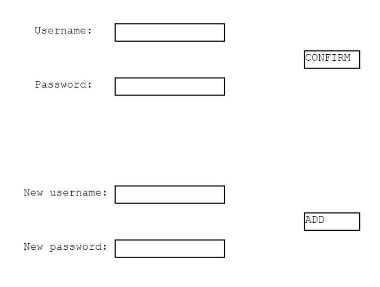

- ### Typing test:
  - #### Settings
    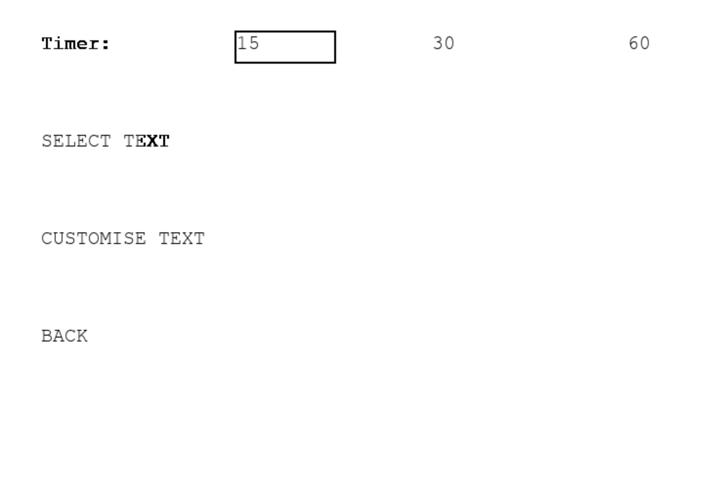
    
    ##### 1. Timer change - 15, 30 or 60 seconds
    ##### 2. Select text - Difficulties + Categories
    ##### 3. Custom text:
  
    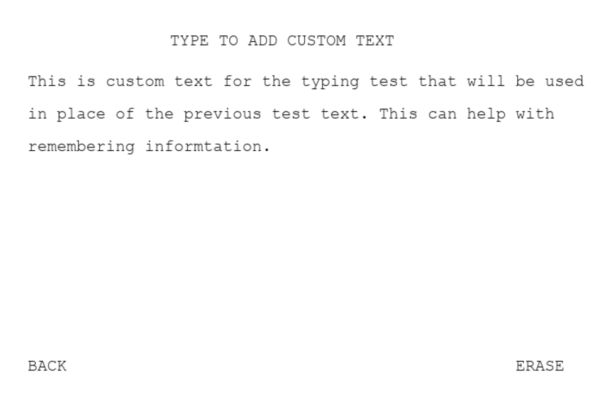

  - #### Results
  
    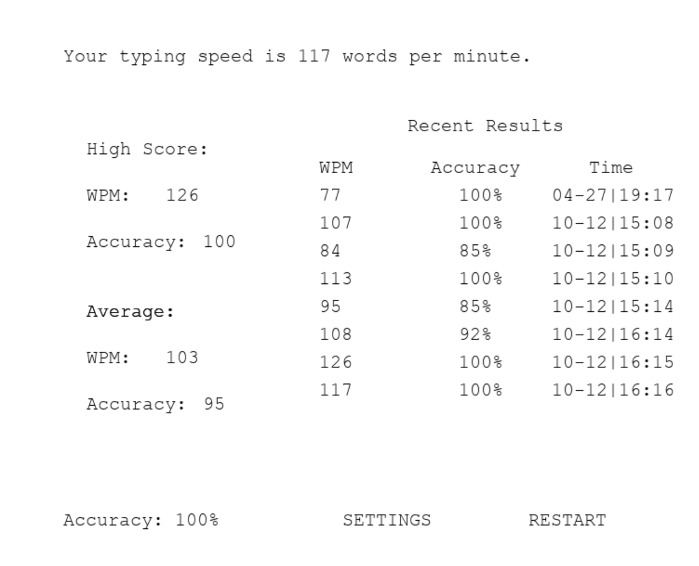
  
    ##### 1. Accuracy and speed calculations
    ##### 2. Average speed and accuracy
    ##### 3. Highscores
    ##### 4. Last 10 results

- ### Word falling minigame:
    
    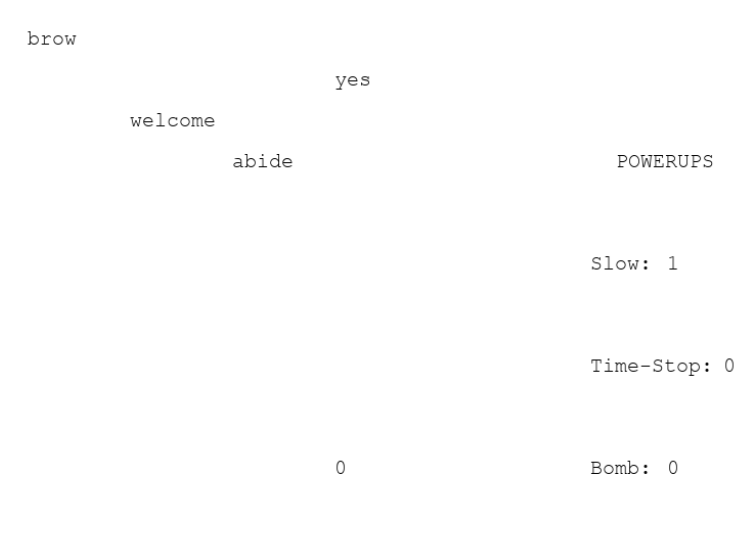

    - #### Shop and money system - Earn money based on performance in minigame
     
      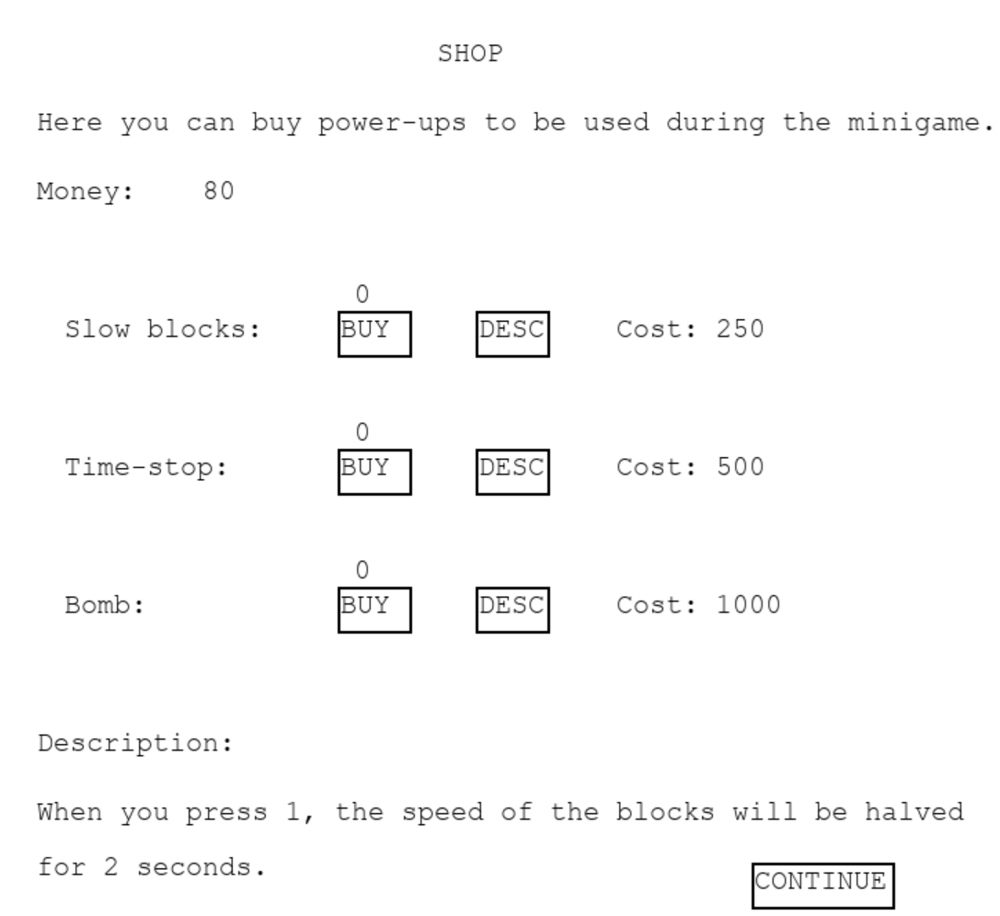
    
    - ##### Power-ups
      - ##### Explosion - Clears the entire screen of words:
        
        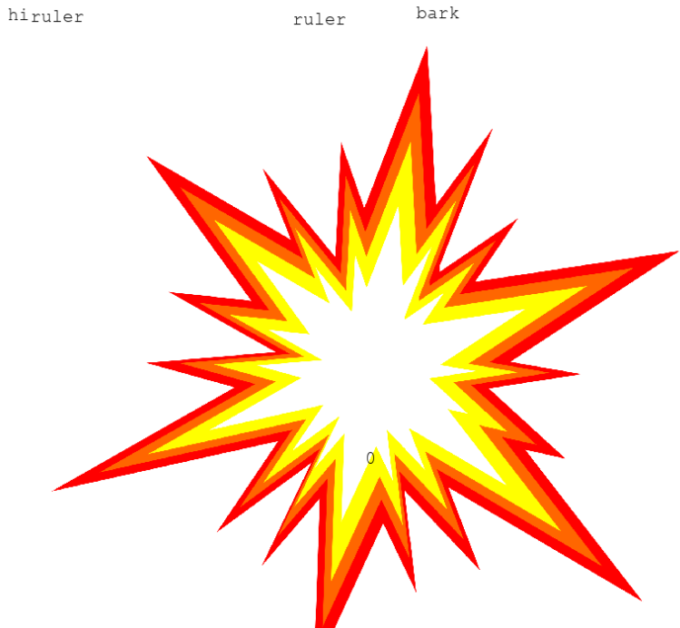

      - ##### Freeze - Stops the words from falling for a few seconds
      - ##### Slow-down - Halves the words' speed for a few seconds
  
    - #### Difficulties - Speed increases with difficulty
      - ##### Easy
      - ##### Medium
      - ##### Hard
      - ##### Survival - Speed doesn't stop increasing
  
- ### Lessons
    - #### Training - Practice with text focusing on each part of the keyboard
    - #### Analysis - Diagnose weaknesses and strengths:
      
      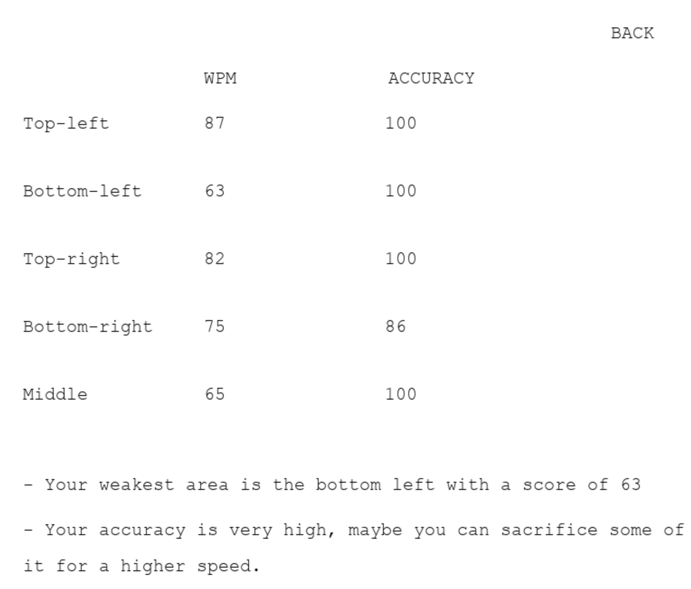

- ### Leaderboards
    - #### Typing Test Leaderboard:

      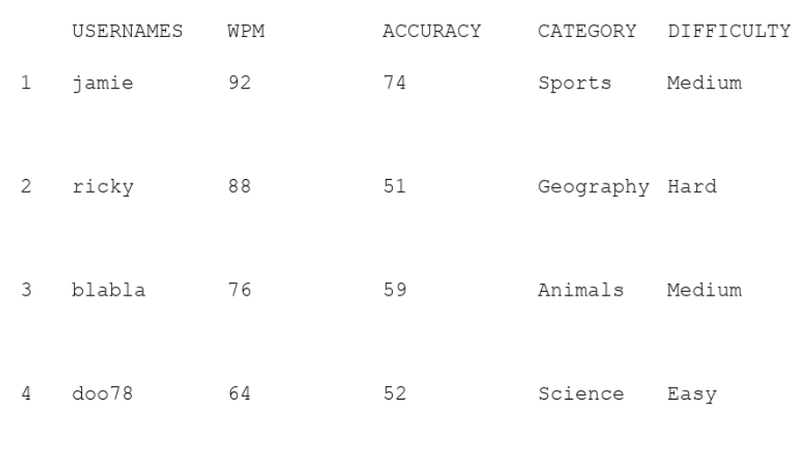

    - #### Minigame Leaderboard:

      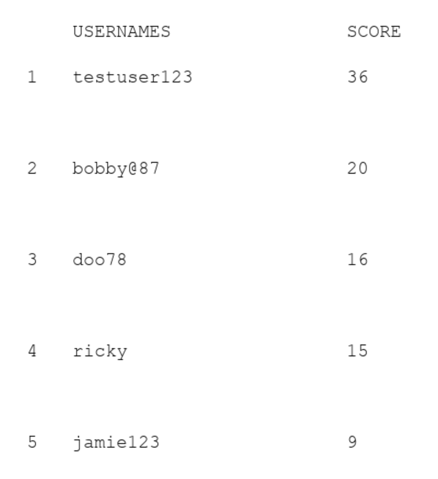

- ### Customer-feedback

  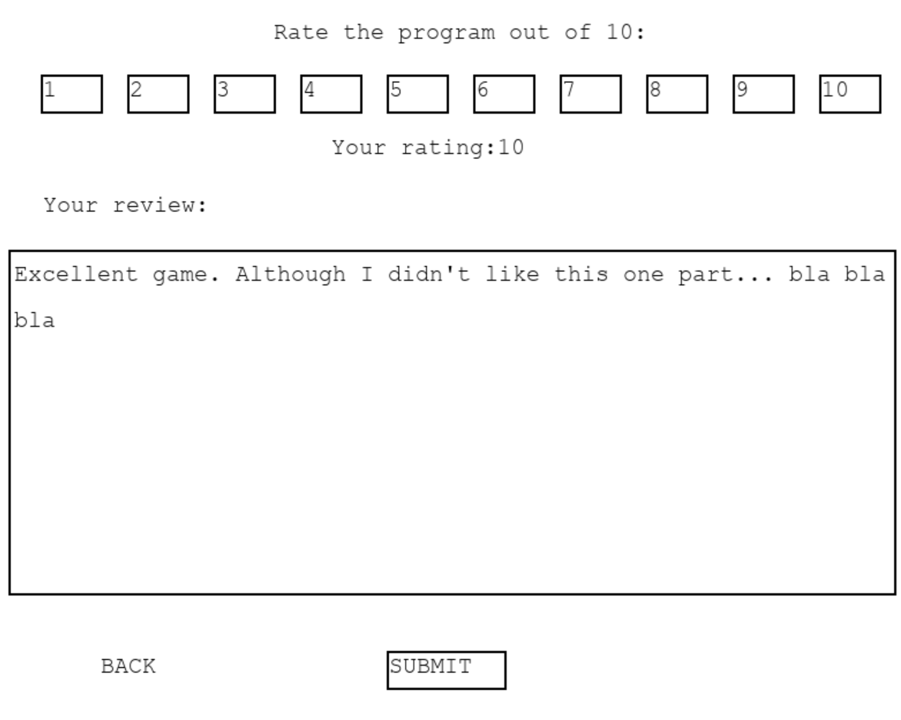

- ### Tips & Tricks - Helpful information, including links to websites for more

  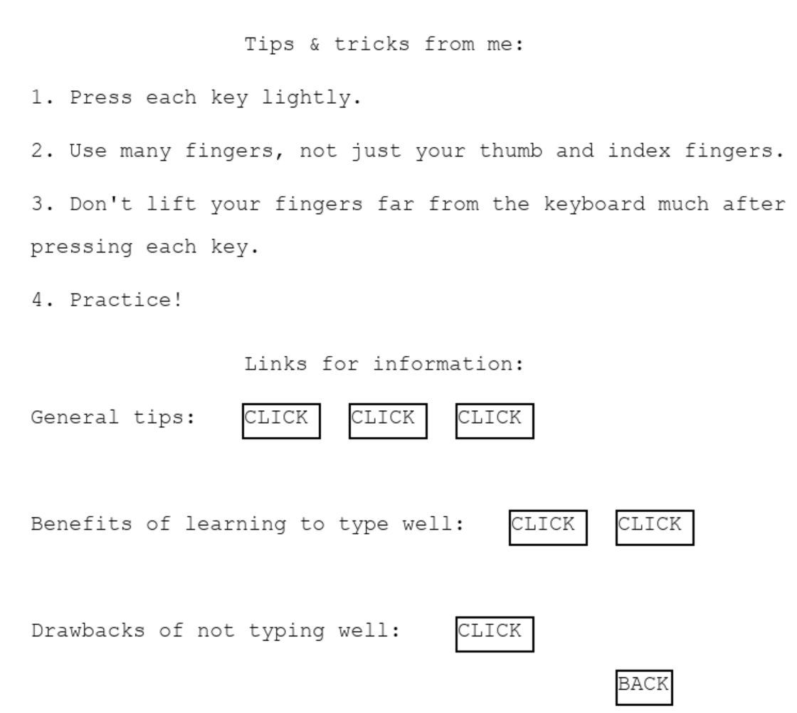

## How to use
- Download the dependencies in the requirements.txt file
-   Can be done using the command:   pip install -r requirements.txt
- Run the python file
